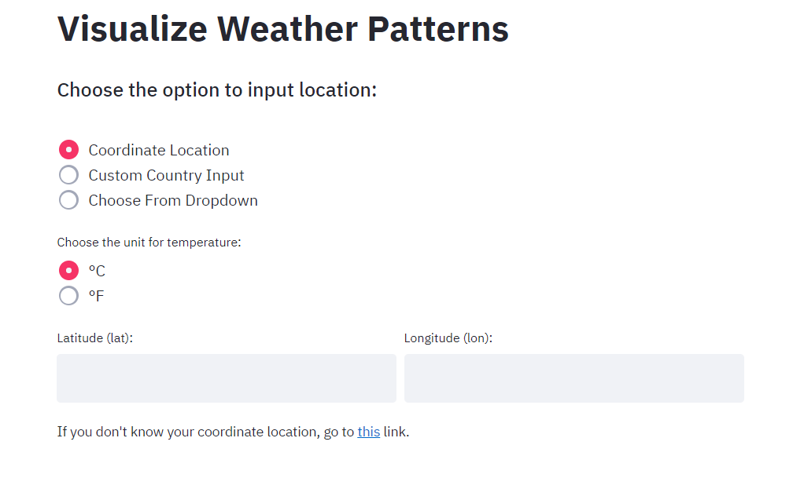
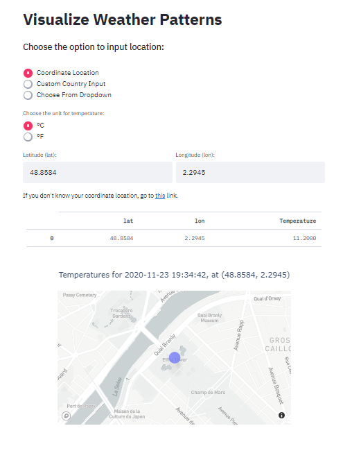
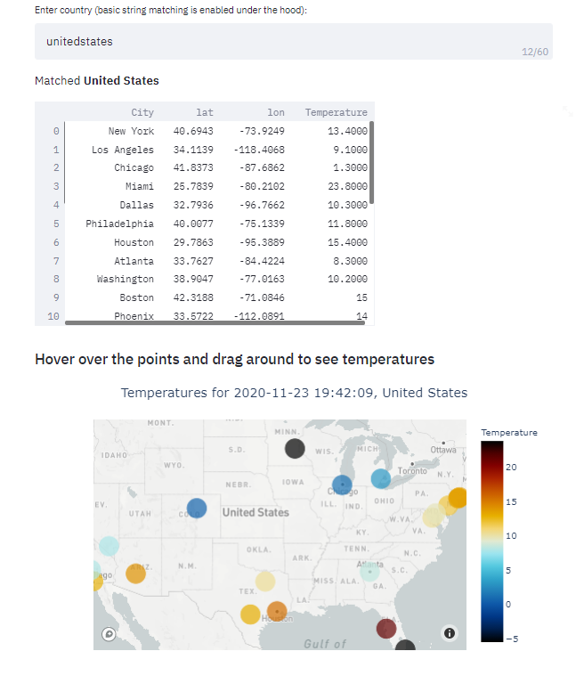
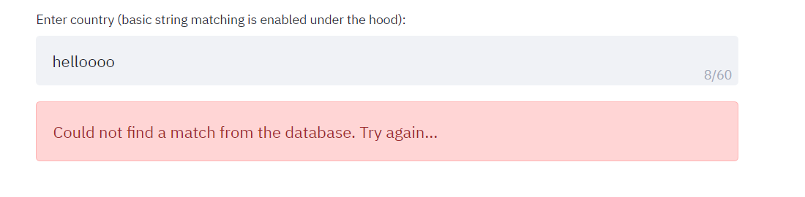

[](https://share.streamlit.io/bextuychiev/climacell_weather_visualizer/app.py)
# Building production-level weather visualizer app in a day
</img>
<figcaption style="text-align: center;">
    <strong>
        Photo by 
        <a href='https://www.pexels.com/@pixabay?utm_content=attributionCopyText&utm_medium=referral&utm_source=pexels'>Pixabay</a>
        on 
        <a href='https://www.pexels.com/photo/close-up-of-gear-shift-over-black-background-248539/?utm_content=attributionCopyText&utm_medium=referral&utm_source=pexels'>Pexels</a>
    </strong>
</figcaption>

Welcome to the Weather Visualizer app. Before moving on to the actual app, you may want to familiarize yourself with some instructions. When you choose the `Run App` mode, you will be directed to a page like this:

> The instructions and extra code explanations can also be found on [this](https://towardsdatascience.com/building-production-level-weather-visualizer-app-in-a-day-e360a68116c7?source=your_stories_page-------------------------------------) Medium article.

</img>
To get realtime weather patterns, you should choose the method of inputting location.

The default is using a single (latitude, longitude) location and it is the best since it only makes one API call. For the input fields, you can input any unit and coordinate location and [Weather API](https://developer.climacell.co/v3/reference) fetches the results which are visualized using Plotly's `scatter_mapbox`:
</img>

To see the temperature, you can hover over the point on the app and zoom in, out, drag around to explore the map itself, courtesy of Plotly.

The next two options of location input are a little different. Custom country input takes any string for country (typos, partial names are allowed) and does a fuzzy string matching under the hood. If there is a match from `data/worldcities.csv`, `pandas` will subset the dataframe for that country taking only top <25 countries based on population size. Using each cities location, the app makes an API call and visualizes the results (it will take a while):
</img>

The last option is just plain old dropdown of available countries, nothing fancy. It will visualize the results in the same way as above. I think I don't have to tell you in the last 2 methods, to visualize one country, the app makes 25 API calls. It means after 4 inputs, you have to wait an hour before you can try the app again because of the hourly limit of the Weather API free plan.

Have fun!

### Moving On To Code

> The script is over 400 lines and growing. Though I cannot explain line by line, I will elaborate on critical points of the app. The best way to understand the source code is getting your hands dirty by experimenting around.

Even though apps are single scripts, Streamlit encourages good software development practices. 

For this reason, one wrapper function, `main()` was created to be called under the `__main__`. For each app modes, single functions were created and each function containing individual helper functions to do specific tasks. The functions which are of most interest are under the `Run app` section. I will only focus on 'backend' functions which perform string matching, making API calls and plotting the results. You can learn how I implemented the logic with Streamlit by reading its [documentation](https://docs.streamlit.io/en/stable/) like I did or reading up some tutorials (I will probably be making some too).

Firstly, fuzzy string matching was performed using `fuzzywuzzy` package:

```python
def match_country(country, df):
    """
    Match user input to available
    countries in the
    :param country: Country of choice 
    :param df: main data
    :return: matching country as str
    """
    # Store unique country names
    unique_countries = set(df['country'].unique())
    # Find all matches for user_input
    match = process.extractOne(country, unique_countries)
    # If similarity is over 70
    if match[1] >= 80:
        return match[0]
    else:
        return 'No match'
```

After the user inputs the country string, it will be inserted into the above function first. Using the unique countries list, `fuzzywuzzy` extracts the best matching country to the input string. If the similarity score is over than 80, it is considered as a match and that country will be returned. Otherwise, an error message will be raised by Streamlit code to tell the user to try again:
</img>

I wrote an entire [article](https://towardsdatascience.com/fuzzywuzzy-fuzzy-string-matching-in-python-beginners-guide-9adc0edf4b35?source=your_stories_page-------------------------------------) on fuzzy string matching. You can read that one too, to master this awesome skill.

```python
def call_api(cities_df, temp_unit):
    """
    Get current weather data
    for top25 cities from cities_df
    based on lat/lon
    """
    # Realtime endpoint
    weather_endpoint = "https://api.climacell.co/v3/weather/realtime"
    # Query params
    params = {
        'unit_system': temp_unit,
        'fields': 'temp',
        'apikey': os.environ['CLIMACELL_API'],
        'lat': '',
        'lon': ''
    }

    def call(row):
        """
        Function to return realtime temperature
        for each lat, lon
        """
        # Build querystring params
        params['lat'] = str(row['lat'])
        params['lon'] = str(row['lon'])
        # Make an API call
        response = requests.request("GET", weather_endpoint, params=params)
        if response.status_code == 200:
            response = json.loads(response.content)
            # Update row
            return round(float(response['temp']['value']), 1)
        else:
            response = '<400>'
            return response

    # Call for API for each row
    cities_df['Temperature'] = cities_df.apply(call, axis=1)
    # Check for status code
    if '<400>' in list(cities_df['Temperature']):
        return 400, None
    else:
        return 200, cities_df

```

The above function is a bit large, I even removed some parts for this article. After we get the country, a separate function will query the top 25 cities (maybe less, depends on the data) of the country based on population size and inserts it into the above function. Then, the function will use its `lat` and `lon` columns to make an API call. The API calls are made using an `apply` function which is much faster than `for` loops and more modular. 

After the temperatures are fetched, they will be stored back into the data frame as a separate column to be plotted later:.

```python
def map_plot(df, country):
    """
    A function to plot a scatter_mapbox
    of plotly
    """
    # Get time for the moment
    now = datetime.now().strftime('%Y-%m-%d %H:%M:%S')
    # Construct the figure
    fig = px.scatter_mapbox(df, hover_data=['Temperature', 'City'],
                            lat='lat', lon='lon',
                            color='Temperature', size='size',
                            color_continuous_scale=px.colors.cyclical.IceFire,
                            zoom=zoom)
    fig.update_traces(textposition='top center')
    fig.update_layout(title_text=f'Temperatures for {now}, {country.title()}', title_x=0.5)

    return fig
```

Finally, we plot the data frame and the results with `map_plot`. It plots each (lat, lon) pair as a separate point on `scatterp_mapbox`. The dots will be colored with a sequential palette using the temperatures. Hovering over the points will display the temperature for that coordinate location.

The dropdown method is performed in a similar manner. For the single coordinate method, instead of inputting a data frame of 25 rows, only one row will be inserted though I created separate functions for each task.